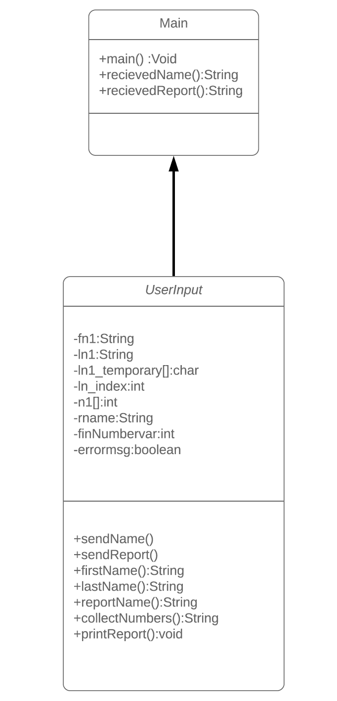

# Reporting Application
- The purpose of creating this program was to take user input and build or compile the input into a visible report.

# Application Features
- Allows user to enter a First Name value and strips out all non Alphabetic characters.

- Allows user to enter a Last Name value and only captures one value at a time. All non Alphabetic character is removed.
    - Unique to the Last Name value there is an escape character of # which allows the user to end entering characters.

- Input verification which removes the following:
     - White Spaces.
     - Numbers.
     - NULL values.

# Program Files
  **Main.java**
   - This is where the Main method and all the static variables reside.
   
  **userInput.java**
   - Examples

  **inputVerification.java**
   - Examples
   
# Known Issues
  **First Name:**
   - When entering a value and a space within the first name variable, the value is accepted and not properly scrubbed.
  
  **Report Name:**
   - Any input over fifty character long will cause the Report Name to become no-longer valid.
   
## UML
