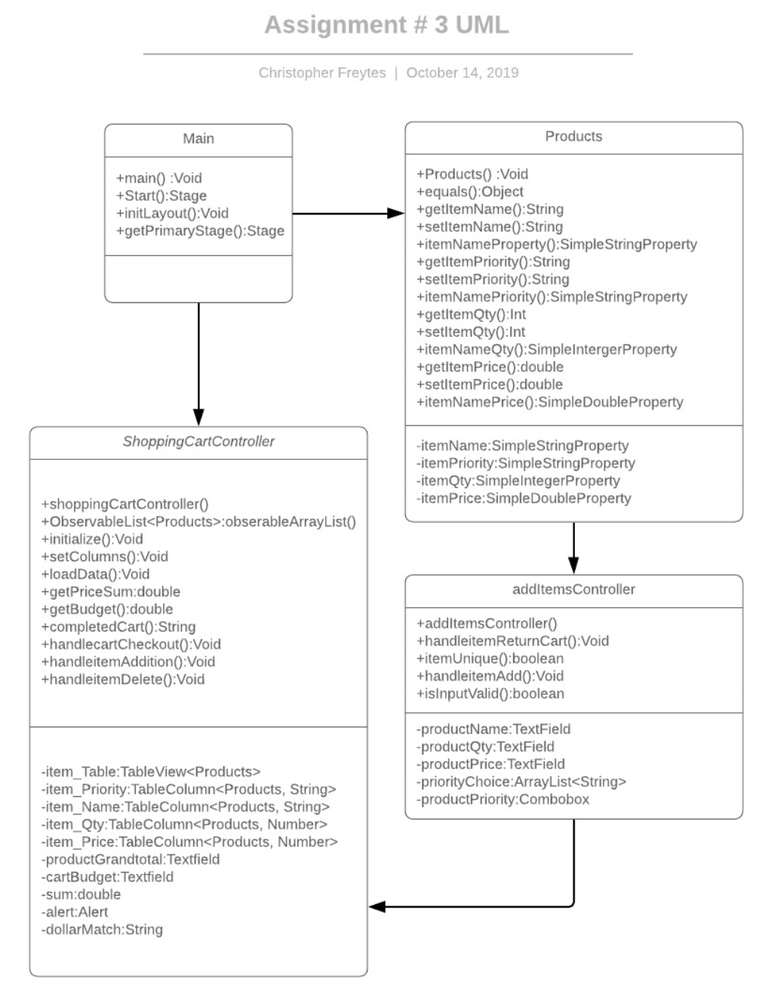

# Shopping Cart Application
- The purpose of creating this program was to take user input and create a shopping cart which allows you to purchase items based on a defined budget.

# Application Features

- GUI interface which leverages JavaFx for a dynamic experience.  
- Implements a Table which is populated from user input.
    - Grand total is automatically populated from the 'Price' column.
    - Budget is fixed at 59.00 usd but can be user defined (feature to be implemented at a later date.) 
    
- The Shopping Cart Application allows users to add items from a different page.
- Allows users to enter a Item name value and strips out all non Alphabetic characters.

    - The Item name cannot be duplicated and must be unique.
- Allows user to enter a Item Priority value which is auto-populated [1-7].
    - Once used the value is automatically removed from the list.
    
- Input verification which removes the following:
     - White Spaces.
     - Numbers (On TextFields (Item Name)).
     - NULL values.

# Program Files
  **Main.java**
   - This is where the Main method resides.
   
  **ShoppingCartController.java**
   
   - Displays an Observable Table List.
   - Allows the user to perform the following actions:
     - Add Items
     - Remove Items
     - Checkout 
   - Grand total is automatically populated based on the prices of the items in the table.
   - Budget is hard set at 59.00 USD.
     
  **AddItemsController.java**
   - Allows the user to add a new item based on the following:
      - Priority
      - Item Name
      - Item Quantity
      - Item Price
   - User Input Verification occurs to ensure the following:
      - No duplicate records are added.
      - No NULL values are added.
      - No illegal strings are added.
        - Letters within numbers.
        - Numbers within strings.
 
  **Products.java**
   - This is where the getter, setters and constructors reside.

# Known Issues
  **Adding New Items**
   - When adding a new item you need to go to the main page before adding a new entry.
   - When you have used all of the priority items, you need to remove all the items listed within the table.
   - All items must be removed from the table not just one item.
  
## Pseudo Code 

1. Main()
    - Display the initial Scene.
2. Products()
   - Getters and setters for the items in the shopping cart.
3. setColumns()
   - Sets Table column headers.
4. loadData()
   - Adds Items to arrayList.
5. getPriceSum()
   - Calculates the sum of all items in the table.
6. getBudget()
   - Calculates a fixed number and sets that information to a TextField.
7. completedCart()
   - Logic which is used to display which items could be purchased based on budget and priority.
     - The displays information as 'Purchased' and 'Not Purchased'.
8. handlecartCheckout()
   - Action which occurs when the user hits the checkout button on the shoppingCartController.
9. handleitemAddition()
   - Action which occurs when the user hits the add button on the shoppingCartController, this button changes the users scene to addItemsController.
10. handleitemDelete()
    - Action which occurs when the user hits the delete all button on the shoppingCartController.   
11. handleitemReturnCart()
    - Action which occurs when the user hits the shoppingCart button on the addItemsController.
12. handleitemAdd()
    - Action which occurs when the user hits the add button on the addItemsController.
13. isInputValid()
    - Logic which occurs after user input to verify if the data is valid.
14. itemUnique()
    - Logic which occurs after user input to verify if the item name is unique.
 

    
## UML
