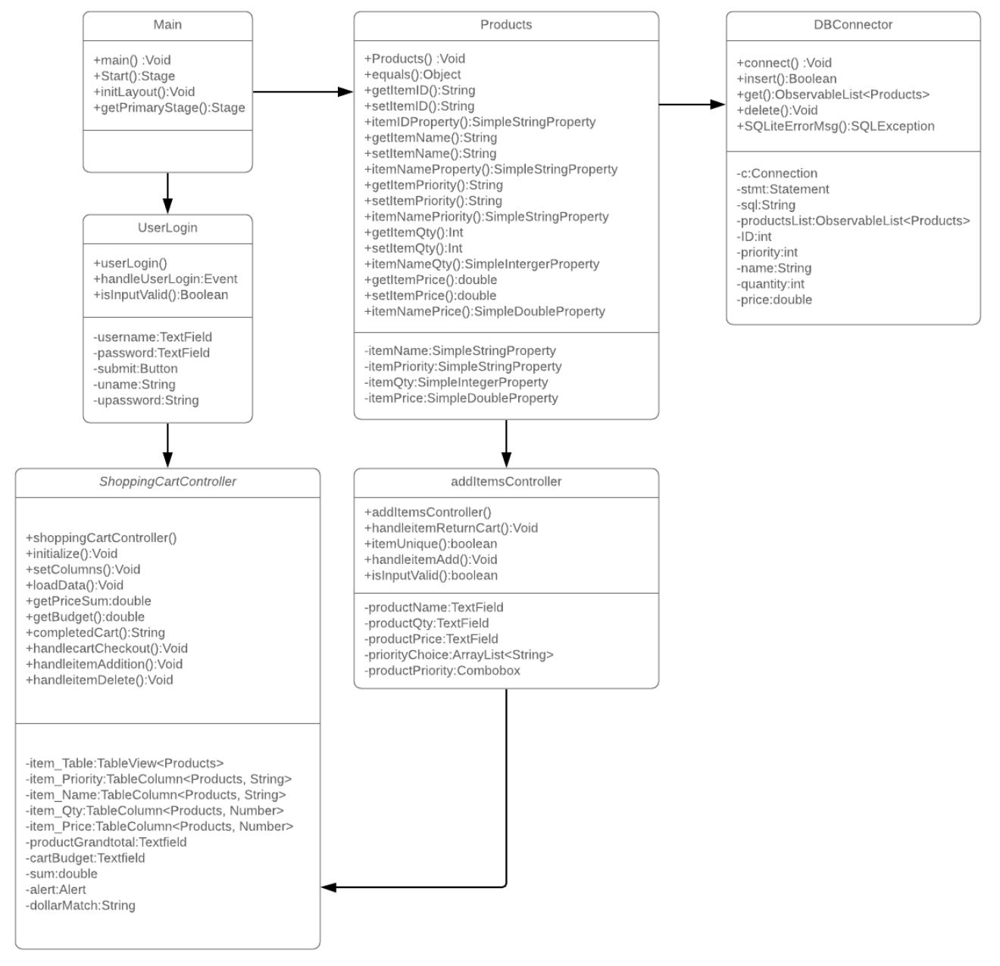

# Shopping Cart Application
- The purpose of creating this program was to take user input and create a shopping cart which allows you to purchase items based on a defined budget.

# Application Features

- GUI interface which leverages JavaFx for a dynamic experience.  
- Implements a Table which is populated from user input.
    - Grand total is automatically populated from the 'Price' column multiplied by the quantity.
    - Budget can be customized via user input.
      
- The Shopping Cart Application allows users to add items from a different page.
- Allows users to enter a Item name value and strips out all non Alphabetic characters.

    - The Item name cannot be duplicated and must be unique.
- Allows user to enter a Item Priority value which is auto-populated [1-10].
    - Multiple Item Priorities can be used, the shopping cart application generated a unique ID per item in the cart.
    
- Input verification which removes the following:
     - White Spaces.
     - Numbers (On TextFields (Item Name)).
     - NULL values.

# Program Files
  **Main.java**
   - This is where the Main method resides.
   
   **DBConnector.java**
   - This is where the database methods reside (CRUD).
   - This is where the ObservableArrayList is defined.
   - Custom SQL exception handling.
   
  **ShoppingCartController.java**
   
   - Displays an Observable Table List.
   - Allows the user to perform the following actions:
     - Add Items
     - Remove Items
     - Checkout 
   - Grand total is automatically populated based on the prices of the items multiplied by the quantity in the table.
   - Budget
     - Cannot be null or zero.
  
  **UserLogin.java** 
  
  - Displays user login information
  - Allows user to add the following information:
    - Username
    - Password
  - User validation is performed to ensure:
    - Username exists.
    - User name does not contain numbers.
    - Password is correct.
  - User information is retrieved via a table in a database called USERS.
  
  **AddItemsController.java**
   - Allows the user to add a new item based on the following:
      - Priority
      - Item Name
      - Item Quantity
      - Item Price
   - User Input Verification occurs to ensure the following:
      - No duplicate records are added.
      - No NULL values are added.
      - No illegal strings are added.
        - Letters within numbers.
        - Numbers within strings.
 
  **Products.java**
   - This is where the getter, setters and constructors reside.

# Known Issues
  **Adding New Items**
   - When adding a new item you need to go to the main page before adding a new entry.
  
## Pseudo Code 

1. Main()
   - Display the initial Scene.
2. Login()
   - Allows login via user input.
3. Connect()
    - Creates the initial database connection.
4. SQLiteErrorMsg()
   - Custom SQL error messages.
5. Insert()
    - Inserts user data into the database.
6. Get()
    - Collects all of the items within the Products Observable Item table.
7. Delete()
    - Removes selected items within the database by unique ID.
8. Products()
    - Getters and setters for the items in the shopping cart.
9. setColumns()
    - Sets Table column headers.
10. loadData()
    - Adds Items to arrayList.
11. getPriceSum()
    - Calculates the sum of all items in the table.
12. getBudget()
    - Calculates a fixed number and sets that information to a TextField.
13. completedCart()
     - Logic which is used to display which items could be purchased based on budget and priority.
      - The displays information as 'Purchased' and 'Not Purchased'.
14. handlecartCheckout()
     - Action which occurs when the user hits the checkout button on the shoppingCartController.
15. handleitemAddition()
     - Action which occurs when the user hits the add button on the shoppingCartController, this button changes the users scene to addItemsController.
16. handleitemDelete()
     - Action which occurs when the user hits the delete all button on the shoppingCartController.   
17. handleitemReturnCart()
     - Action which occurs when the user hits the shoppingCart button on the addItemsController.
18. handleitemAdd()
     - Action which occurs when the user hits the add button on the addItemsController.
19. isInputValid()
     - Logic which occurs after user input to verify if the data is valid.
    
## UML
